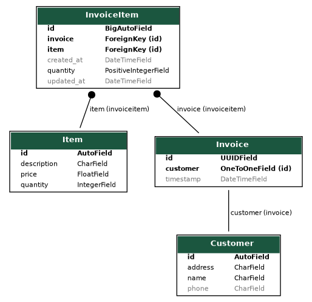
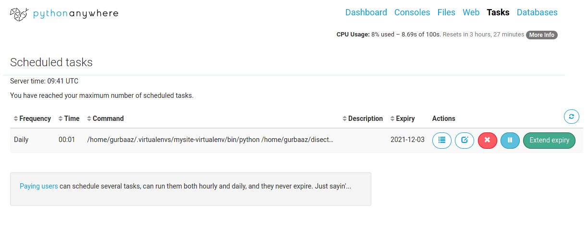

# Disecto : Backend Dev Assignment

- [Assumptions](#assumptions)
- [Setup](#setup)
- [Urls](#urls)
- [Models](#models)
- [Task 2](#task-2)
- [Hosting](#hosting)
- [Task 4](#task-4)


## assumptions

- `PUT` method either creates request for new items and/or update requests of previous items. Items not included in a `PUT` request, if they exist in invoice earlier, do not get deleted. 
- if `POST` method is called for an item that is already in invoice, it would result in error. the task of updation is solely via `PUT` method 
- if there is error for even one item in `POST` or `PUT` (i.e. due to insufficient stocks, item id does not exist etc), entire request fails. this ensures that there is no ambuiguity on what items quantity got updated and what items got rejected.
- each invoice is one-to-one mapped to customer. practically there could be many invoices per customer and it should be many-to-one mapped. but keeping things simple here (as then one would also need to provide some sort of invoice `id` apart from customer `id` while testing) 
- invoice template has been taken from weasyprint examples, and works on single page invoice pdf. hence in case of large no. of items, invoice pdf may hide some items


## setup

- clone the repository

```
git clone https://github.com/gurbaaz27/disecto-backdev-task.git
cd disecto-backdev-task
```

- create virtual environment using `venv` or `conda`

```
conda create -n venv python -y
conda activate venv
```

- install the dependencies

```
pip install -r requirement.txt
cd disecto
```

- setup your models and database, collect static files (optional), create a superuser (to explore admin dashboard)

```
python manage.py makemigrations
python manage.py migrate
python manage.py collectstatic
python manage.py createsuperuser
```

- fire up your server and head over to [http://127.0.0.1:8000](http://127.0.0.1:8000)

```
python manage.py runserver
```

## urls

(apis can be tested on cloud simply by replacing <https://127.0.0.1:8000> with <https://gurbaaz.pythonanywhere.com>)

**1.**
```
http://127.0.0.1:8000/api/items/
```
GET: get the list of available items with details such as (unique item id, name, price, description).
It also supports POST method, in case one wants to add a new item in inventory. A json example for post method is as follows
```json
{
    "description": "xyz",
	"price": 9999,
	"quantity": 100
}
```

**2.**
```
http://127.0.0.1:8000/api/customers/
```
GET: get the list of customers with details such as (unique customer id, name, phone no, address).
It also supports POST method, in case one wants to add a new customer. A json example for post method is as follows
```json
{
    "name": "xyz",
	"phone": "+9999999999",
	"address": "xyz"
}
```

**3.**
```
# note that these methods need a customer id, which can be retreived from GET /api/customers/ mentioned above
http://127.0.0.1:8000/api/customer-purchase/<int:customer-id>
```

- GET: get the invoice for the purchase in pdf format as per the above format but with all the necessary details filled dynamically
- POST: to send the list of items to buy with corresponding quantities.
- PUT: to update the list of items in the purchase list.

A json example for post/put method is as follows (these requests need the item id in "item" field, which can be seen from GET /api/items/ mentioned above)
```json
[
  {
		"item": 4,
		"quantity": 1
  },
	{
		"item": 5,
		"quantity": 9
  }
]
```

**4.**
```
http://127.0.0.1:8000/api/low-stock-items/
```
GET : returns txt file containing item list of low stock

## models



- Customer (Name, Phone No., Address)
- Item (Description, Price)
- Invoice (Customer, Timestamp)
- InvoiceItems (Invoice, Item, Quantity)


## task 2

created a django management command `generate_stock_list` (location : `disecto/invoice/management/commands/generate_stock_list.py`) to generate a list of products/items with low stock/expiry from the inventory database.

```
python manage.py generate_stock_list --help

usage: manage.py generate_stock_list [-h] [--version] [-v {0,1,2,3}] [--settings SETTINGS] [--pythonpath PYTHONPATH] [--traceback] [--no-color]
                                     [--force-color] [--skip-checks]

Auto generate a list of products/items with low stock/expiry from the inventory database.
```

below command can be scheduled via `cron` command-line utility to schedule job for 12 AM daily on the server side

```
python manage.py generate_stock_list
```

the equivalent cronfile which has been scheduled in `pythonanywhere` cloud is in `stocklist.cron`

```
01 00 * * * /home/gurbaaz/.virtualenvs/mysite-virtualenv/bin/python /home/gurbaaz/disecto-backdev-task/disecto/manage.py generate_stock_list
```
(for some reason, pythonanywhere doesn't schedule at 12AM, hence we are scheduling it at 12:01AM instead)

it generates `stocklist.txt` which can be accessed via GET method on following api

```
http://127.0.0.1:8000/api/low-stock-items/
```



## hosting

the server has been hosted on [gurbaaz.pythonanywhere.com](https://gurbaaz.pythonanywhere.com)

apis can be tested simply by replacing <https://127.0.0.1:8000> with <https://gurbaaz.pythonanywhere.com>

## task 4

(the question statement was vague, but i tried my best to get the jist of it, and answered accordingly)

the two servers of website need to communicate with each other in some way to ensure that when one user is added in one website, it would automatically add user to another website. hence if user gets added to one website, after creating new user object and adding it to database, it would make a post api call to other website's server and send the information of user (say, in a json format). so basically apart from interacting with respective clients, the servers have a gateway among themselves too (needless to say, this connection should be secure) if the two user table are exactly same in terms of fields like name, phoneno, etc, the job is easy. else we can use model serializers on both sides and pass the json (which is received from one server) through the serializer, which would pick out the appropriate fields which the user table needs in its database. also, ideally these requests should be handled asyncronously (basically it goes side by side, put in some queue and user is freely doing things on server he want), that is, we won't want user's experience after registration to come to halt just because server is sending data to other server (this actually won't take much time, but depending on user traffic, we are never so sure).  